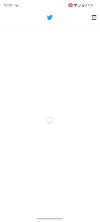

# Twitter News Feed

## Goal

The goal was to create a News Feed app with the following conditions:
1. "Endless" loading of news;
2. Choice of displaying news in tiles or list form (whatever it means).

## Development

### Packages

The main packages that I have used in the app are as follows:

`cached_network_image` `dio` `flutter_mobx` `get_it` `freezed` `json_serializable`

### State management

MobX is used as a state management since it provides a better way to update the UI when the list of user tweets changes.